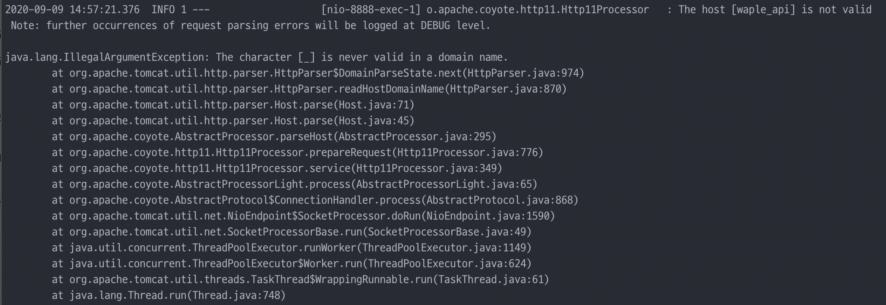
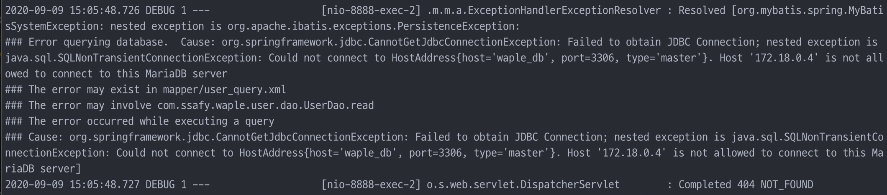

# 웹서비스 배포하기 - 2

Date: Sep 10, 2020

[Docker, Docker-compose 설치하기 (Ubuntu 18.04)](https://www.notion.so/Docker-Docker-compose-Ubuntu-18-04-347a11e1f448428fac3205939b868912)

를 작성했다. 그리고...

---

## The host is not valid



### 원인

nginx의 conf에서 proxy를 보낼 때 host 주소를 waple_api로 가게 해서인듯

### 해결

nginx의 conf에 `proxy_set_header` 세 줄 추가함!

```bash
location /api {
        proxy_pass http://waple_api:8888;
        proxy_set_header Host $host:$server_port;
        proxy_set_header X-Real-IP $remote_addr;
        proxy_set_header X-Forwarded-For $proxy_add_x_forwarded_for;
        rewrite /api/(.*) /$1 break;
    }
```

## SpringBoot - DB 연결 안 되는 문제



도커 내부 마리아디비에 접속해서 유저 테이블을 봐야 할 듯

근데 지금 로그인이 안됨

도커 컴포즈 설정에서 일단 루트 계정 만들어서? 체크를 해봐야 할듯..?