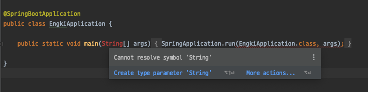
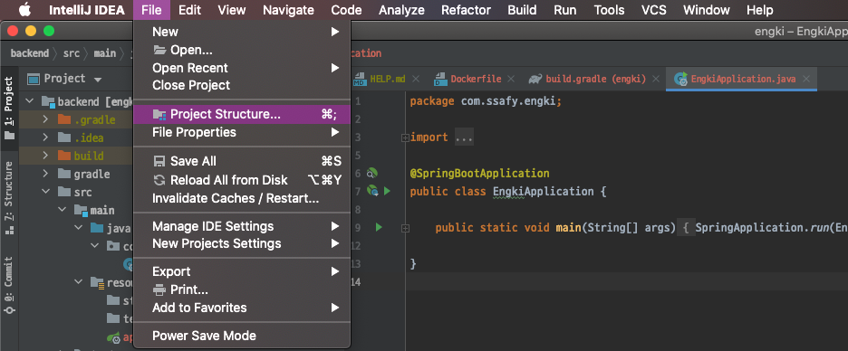
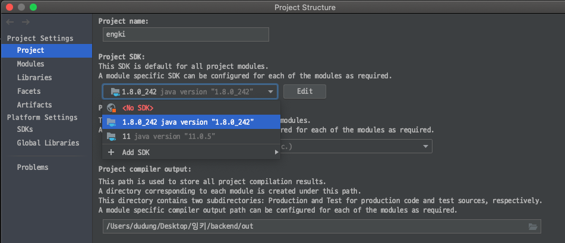

# 이노무 Cannot resolve symbol 'String'!!!!

Date: 2020년 9월 22일
Tags: Docker, IDE

진짜.. 인텔리제이 다 좋은데 저게 날 정말 화나게 한다.........



으윽.jpg

→ SDK 재설정? 지정? 해주자...





### 포트폴리오 특강

- 지원 회사의 CI/BI(로고)같은 걸 넣어주면 플러스
- 문서에 page indicator를 넣어주면 좋다 (페이지 번호..같은거)

### Mirror repo

**[Mirroring a repository in another location](https://docs.github.com/en/github/creating-cloning-and-archiving-repositories/duplicating-a-repository#mirroring-a-repository-in-another-location)**

If you want to mirror a repository in another location, including getting updates from the original, you can clone a mirror and periodically push the changes.

1. Open Terminal.
2. Create a bare mirrored clone of the repository.

    ```bash
    git clone --mirror https://github.com/*exampleuser*/*repository-to-mirror*.git
    ```

3. Set the push location to your mirror.

    ```bash
    cd *repository-to-mirror*.git
    git remote set-url --push origin https://github.com/*exampleuser*/*mirrored*
    ```

As with a bare clone, a mirrored clone includes all remote branches and tags, but all local references will be overwritten each time you fetch, so it will always be the same as the original repository. Setting the URL for pushes simplifies pushing to your mirror. To update your mirror, fetch updates and push.

```bash
$ git fetch -p origin
$ git push --mirror
```

git hook을 이용해서 자동으로 미러 레포에도 업데이트를 시키는 방법이 있다는데... 나중에 알아봐야겠다...

### 저번에 이은 mariadb 비번 틀리다는 문제..

(분명히 이 아이디와 이 비번이 맞는데!)

```bash
ERROR 1045 (28000): Access denied for user 'deki'@'localhost' (using password: YES)
```

으으윽.log

결론적으로... 정말 비번이 틀린게 맞았다. 아니 걍.. 유저가 없었던 것...

docker-compose의 env에

`MYSQL_USER:'name'@'*'` 이렇게 해두었었는데... (모든 호스트에서 허용하겠답시고 ㅋㅋㅋ) 이게 문제였다...

그냥 평범하게 이름만 했더니 되네.. 흑흑

근데 디비 데이터를 바인딩을 시켜놓고 계속 갖다가 쓰기 때문에,
유저를 바꾸고 싶을 땐 디비 데이터도 날리고 도커 이미지도 날리고 다시 실행해야.. 한다!

```bash
# 디비 날리기
cd data
sudo rm -rf mysql
mkdir mysql
cd ..

docker stop engki_db
docker rm engki_db
sh run_docker_compose.sh
```