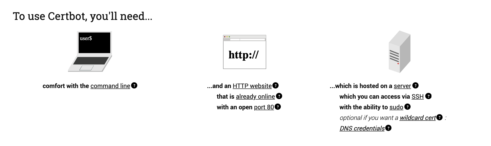

# https

Date: 2020년 10월 5일

웹사이트에서 웹캠을 써야 하는데... http는 브라우저 웹캠에 접근 불가라서 https를 해야 하게 되었다. 그래서 무료 인증서를 만들 수 있는, let's encrypt를 해보기로 결정.

### SSL 인증서 발급받기

[Getting Started](https://letsencrypt.org/getting-started/)

난 shell access가 되기 때문에 certbot을 사용하기로 했고,

내 http 웹사이트는 ubuntu 18.04에서 nginx(docker)를 웹서버로 사용하고 있다. 그냥 nginx가 아니다..!

[Certbot - Ubuntubionic Webproduct](https://certbot.eff.org/lets-encrypt/ubuntubionic-webproduct)



[Docker Nginx 컨테이너를 이용한 Letsencrypt 적용법](https://idchowto.com/?p=48536)

우선 ubuntu에 `/var/www/letsencycrpt/.well-known/acme-challenge` 폴더를 만들어준다. sudo 권한이 필요하다.

nginx의 conf에 추가해주고,

```
location ^~ /.well-known/acme-challenge/ {
	default_type “text/plain”;
	root /var/www/letsencrypt;
}
```

docker-compose에 volume 을 바인딩해준다.

```
/var/www/letsencrypt:/var/www/letsencrypt
```

이제 인증서를 요청하자.

```bash
$ sudo certbot certonly --webroot -d 도메인 -w /var/www/letsencrypt

Saving debug log to /var/log/letsencrypt/letsencrypt.log
Plugins selected: Authenticator webroot, Installer None
Obtaining a new certificate
Performing the following challenges:
http-01 challenge for 도메인
Using the webroot path /var/www/letsencrypt for all unmatched domains.
Waiting for verification...
Cleaning up challenges
Subscribe to the EFF mailing list (email: 이메일주소).

IMPORTANT NOTES:
 - Congratulations! Your certificate and chain have been saved at:
   /etc/letsencrypt/live/도메인/fullchain.pem
   Your key file has been saved at:
   /etc/letsencrypt/live/도메인/privkey.pem
   Your cert will expire on 2021-01-03. To obtain a new or tweaked
   version of this certificate in the future, simply run certbot
   again. To non-interactively renew *all* of your certificates, run
   "certbot renew"
 - If you like Certbot, please consider supporting our work by:

   Donating to ISRG / Let's Encrypt:   https://letsencrypt.org/donate
   Donating to EFF:                    https://eff.org/donate-le
```

서버가... 내년 1월 3일까지 켜져있지 않기 때문에 자동 갱신은 안했다.

---

### front 설정

인증서를 받았으니, https 설정을 해주자.

nginx의 conf를 아래처럼 바꿔준다.

```
server {
    listen 80;
    server_name _;

    return 301 https://$host$request_uri;
}

server {
    listen 443 ssl;

    root /usr/share/nginx/html;
    index index.html;
    server_name _;

    ssl_certificate             /etc/letsencrypt/live/도메인/fullchain.pem;
    ssl_certificate_key         /etc/letsencrypt/live/도메인/privkey.pem;
    ssl_session_timeout         5m;
    ssl_protocols               SSLv2 SSLv3 TLSv1.2;
    ssl_ciphers                 HIGH:!aNULL:!MD5;
    ssl_prefer_server_ciphers   on;

    location / {
        try_files $uri $uri/ /index.html;
    }
}
```

위의 `ssl_protocols`가 많은 레퍼런스에 `TLSv1`로 되어있는데, 그럼 크롬에서 safety하지 않다고.. 뭐라고 한다.

그리고 docker-compose에 받은 인증서 폴더를 바인딩해주자.

```
/etc/letsencrypt:/etc/letsencrypt
```

---

그랬더니... front는 https인데 api서버는 http라고 ... 요청을 block해버렸다...

그래서 스프링부트도... https 시켜줘야 한다...

[How can I set up a letsencrypt SSL certificate and use it in a Spring Boot application?](https://stackoverflow.com/a/38873138)

는 생각보다 정말 간단한걸...?

위에 링크에 써있는대로, 인증서가 있는 폴더에 가서 `keystore.p12` 이름으로 만들어주고

application.properties에

```
security.require-ssl=true
server.ssl.enabled=true
server.ssl.key-store=/etc/letsencrypt/live/example.com/keystore.p12
server.ssl.key-store-password=<your-password>
server.ssl.keyStoreType=PKCS12
server.ssl.keyAlias=tomcat
```

를 넣어주면 끝!

많은 레퍼런스에서 port를 8443으로 하길래 무조건 그렇게 해야 하나? 했는데 그냥 관용적으로 쓰는 포트인듯 하다. 다른 포트로 해도 잘 작동한다.

+) 인증서 폴더 docker-compose에서 volume 연결 해주기!