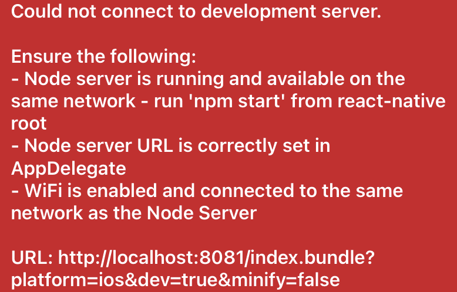
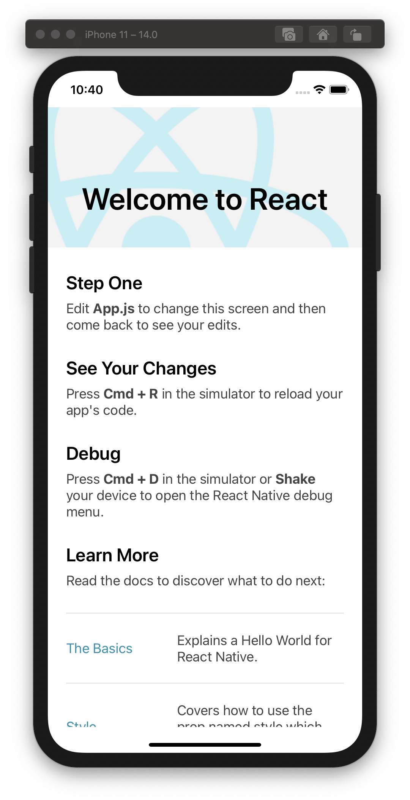

# React native 앱 ios Simulator에서 실행시키기

Date: 2020년 10월 26일
Tags: React native

```bash
# react native 폴더에서
npm install
npx react-native run-ios
```

- 를 했는데 `'React/RCTBridgeDelegate.h' file not found` 에러가...

    ```bash
    In file included from /Users/dudung/Desktop/PhotoDiary/frontend/ios/frontend/AppDelegate.m:1:
    /Users/dudung/Desktop/PhotoDiary/frontend/ios/frontend/AppDelegate.h:1:9: fatal error: 'React/RCTBridgeDelegate.h' file not found
    #import <React/RCTBridgeDelegate.h>
            ^~~~~~~~~~~~~~~~~~~~~~~~~~~
    1 error generated.
    ```

    → `pod install`을 해주면 된단다.

    `pod`를 쓰기 위해서 `brew install cocoapods`를 먼저 해주자.

- 노우... `No bundle URL present` 에러가...

    

    [What is the meaning of 'No bundle URL present' in react-native?](https://stackoverflow.com/a/44080527)

    으흠 그렇구만 매번 빌드를 삭제해줘야 하는 건가... 오케오케

    `rm -rf ios/build/; kill $(lsof -t -i:8081); npx react-native run-ios`

- 이번엔 `Could not connect to development server` 에러가...

    

    오오케... npm start 해보라고?

    ```bash
    events.js:292
          throw er; // Unhandled 'error' event
          ^
    ```

    ...안되네

    [How to Fix "throw er; // Unhandled 'error' event"?](https://peterthaleikis.com/posts/how-to-fix-throw-er-unhandled-error-event.html)

    오... 노드모듈 지우고 해보라고? 오케

    ```bash
    rm -rf node_modules
    rm package-lock.json yarn.lock
    npm cache clear --force
    npm install
    ```



갹 된다