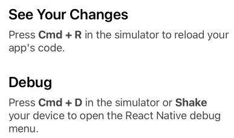
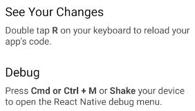
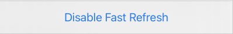
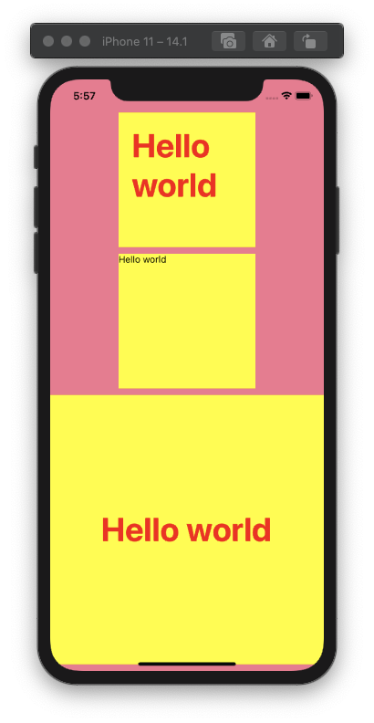

# React-native cli로 시작하기

Date: 2020년 10월 27일
Tags: React native

## Install

나는 Mac에서 brew, zsh 사용중..!

1. `nvm` 설치하기
    1. `brew install nvm`
    2. `~/.zshrc`에 아래 추가

        ```bash
        NVM_DIR=~/.nvm
        source $(brew --prefix nvm)/nvm.sh
        ```

    3. `nvm --version`으로 확인
2. `node` 설치하기
    1. `nvm install 10.15.1` (강의에서 사용하는 버전)
    2. `node --version`으로 확인
3. Android Studio 설치
    1. JetBrains Toolbox 사용함
    2. `~/.zshrc`에 아래 추가

        ```bash
        # 아래 Android home은 android studio의 sdk 설치 경로
        export ANDROID_HOME=/Users/dudung/Library/Android/sdk
        export PATH=$PATH:$ANDROID_HOME/emulator
        export PATH=$PATH:$ANDROID_HOME/tools
        export PATH=$PATH:$ANDROID_HOME/tools/bin
        export PATH=$PATH:$ANDROID_HOME/platform-tools
        ```

    3. `abd`로 확인
    4. Android Simulator에서 SDK Manager 열고 Q (10) 설치
    5. AVD Manager 열고 Emulator 생성
4. Java 설치
    1. 이전에 설치해둠 (openjdk 사용)
    2. `java --version`으로 확인
5. XCode 설치
    
    1. Simulator 하나 만들어주기
6. vscode... 대신 webstorm 사용할 것
7. CocoaPod 설치
    1. `brew install cocoapods`
    2. `pod --version`으로 확인
8. `React Native CLI` 설치
    1. `npm install -g react-native-cli`
    2. `react-native --version`으로 확인

## Start new project

1. 프로젝트 생성

    `react-native init --version 0.61.5 my_first_app`

2. iOS Simulator 실행
    1. 터미널에서 `yarn start`
    2. 터미널 새로 열고 `react-native run-ios`
        1. 시뮬레이터 다른 기기에서 열고 싶다면 `--simulator="iPhone 8 Plus"` 처럼 붙여주자

    

    → 수정 내용 반영 : `cmd+r` (simulator)

    → Debug : `cmd+d`

    

    이거 누르면 직접 리프레시 해줘야함 켜놓자

3. Android Emulator
    1. Android Studio에서 Virtual Device Run시키기
    2. 터미널 새로 열고 `react-native run-android`

    

    → 수정 내용 반영 : double `r`

    → Debug : `cmd+m`

## Hello World 출력하기

강의는 class 기반으로 되어있는데, 
react native 공식 document 보니까 함수 기반을 권장하는 것 같아서 그렇게 해보도록 하겠다.

`App.js` 이렇게 수정

```jsx
import React, {useState} from 'react';
import {View, Text, StyleSheet} from 'react-native';

const App = () => {
    return (
        <View style={styles.background}>
          <Text>Hello World</Text>
        </View>
    )
}

const styles = StyleSheet.create({
    background: {
        flex: 1,
        backgroundColor: '#fff',
        alignItems: 'center',
        justifyContent: 'center',
    }
})

export default App;
```

## [State](https://reactnative.dev/docs/intro-react/#state)

- `useState` Hook을 사용한다. (`import React, {useState} from 'react';`)

```jsx
const App = () => {
    const [sampleText, setSampleText] = useState('Hello World');

    const inputText = () => (
        sampleBoolean ?
            <Text>sampleBoolean is true</Text>
            :
            <Text>sampleBoolean is false</Text>
    )

    return (
        <View style={styles.background}>
            <Text onPress={() => {
                setSampleBoolean(!sampleBoolean);
            }}>
                {inputText()}
            </Text>
        </View>
    )
}
```

## [Props](https://reactnative.dev/docs/intro-react/#props)

- `props`에 함수 객체를 전달할 때 `함수()`의 형태로 쓰지 않도록 주의!
- 전달받은 함수 사용 시
    1. parameter 없음 → `props.toggle`
    2. parameter 있음 → `() => props.toggle(param)`

```jsx
const Child = (props) => {
    return (
        <View>
            <Text onPress={props.toggle}>
                {props.text}
            </Text>
        </View>
    )
}

const App = () => {
    const [sampleBoolean, setSampleBoolean] = useState(false);

    const inputText = () => (
        sampleBoolean ?
            <Text>sampleBoolean is true</Text>
            :
            <Text>sampleBoolean is false</Text>
    )

    const toggle = () => {
        setSampleBoolean(!sampleBoolean);
    }

    return (
        <View style={styles.background}>
            <Child text={inputText()} toggle={toggle}/>
        </View>
    )
}
```

## Style

```jsx
import React from 'react';
import {View, Text, StyleSheet} from 'react-native';

const App = () => {
    return (
        <View style={styles.mainView}>
            <View style={styles.subView}>
                <Text style={styles.mainText}>Hello world</Text>
            </View>
            <View style={styles.subView}>
                <Text>Hello world</Text>
            </View>
            <View style={styles.anotherSubView}>
                <Text style={styles.mainText}>Hello world</Text>
            </View>
        </View>
    )
}

const styles = StyleSheet.create({
    mainView: {
        flex: 1,
        backgroundColor: '#f4768f',
        paddingTop: 50,
        alignItems: 'center',
        justifyContent: 'center',
    },
    subView: {
        flex: 1,
        backgroundColor: 'yellow',
        marginBottom: 10,
        width: '50%',
    },
    anotherSubView: {
        flex: 2,
        backgroundColor: 'yellow',
        marginBottom: 10,
        width: '100%',
        alignItems: 'center',
        justifyContent: 'center',
    },
    mainText: {
        fontSize: 50,
        fontWeight: 'bold',
        color: 'red',
        padding: 20,
    }
})

export default App;
```



## Touch event

### [TouchableOpacity](https://reactnative.dev/docs/touchableopacity)

이벤트 발생 시 살짝 투명해진다.

style property가 있음.

```jsx
<TouchableOpacity
    style={styles.header}
    onPress={() => alert('hello world')}
>
    <View>
        <Text>{props.name}</Text>
    </View>
</TouchableOpacity>
```

<iframe width="560" height="315" src="https://www.youtube-nocookie.com/embed/HjBhu7bpTQ8" frameborder="0" allow="accelerometer; autoplay; clipboard-write; encrypted-media; gyroscope; picture-in-picture" allowfullscreen></iframe>

### [TouchableWithoutFeedback](https://reactnative.dev/docs/touchablewithoutfeedback)

이벤트가 발생해도 view에 변화가 없다.

style property가 없음.

```jsx
<TouchableWithoutFeedback
    onPress={() => alert('hello world')}
>
    <View style={styles.header}>
        <Text>{props.name}</Text>
     </View>
</TouchableWithoutFeedback>
```

<iframe width="560" height="315" src="https://www.youtube-nocookie.com/embed/lWlLLJpMXCY" frameborder="0" allow="accelerometer; autoplay; clipboard-write; encrypted-media; gyroscope; picture-in-picture" allowfullscreen></iframe>

## TouchEvent 심화 : Random 숫자 추가 / 삭제

<iframe width="560" height="315" src="https://www.youtube-nocookie.com/embed/qUqhPZRNBlQ" frameborder="0" allow="accelerometer; autoplay; clipboard-write; encrypted-media; gyroscope; picture-in-picture" allowfullscreen></iframe>

- `App.js`

    ```jsx
    import React, {useState} from 'react';
    import {View, Text, StyleSheet} from 'react-native';
    import Header from "./src/header";
    import Generator from "./src/generator";
    import NumList from "./src/numlist";

    const App = () => {
        const [appName] = useState('My First App')
        const [random, setRandom] = useState([])

        const onAddRandomNum = () => {
            const randomNum = Math.floor(Math.random() * 100) + 1
            setRandom([...random, randomNum])
        }

        const onNumDelete = (position) => {
            const newArray = random.filter((num, index) => position !== index)
            setRandom(newArray)
        }

        return (
            <View style={styles.mainView}>
                <Header name={appName}/>

                <View>
                    <Text
                        style={styles.mainText}
                        onPress={() => alert('text touch event')}
                    >
                        Hello world
                    </Text>
                </View>

                <Generator add={onAddRandomNum}/>

                <NumList
                    num={random}
                    delete={onNumDelete}
                />
            </View>
        )
    }

    const styles = StyleSheet.create({
        mainView: {
            flex: 1,
            backgroundColor: '#fff',
            paddingTop: 50,
            alignItems: 'center',
            // justifyContent: 'center',
        },
        subView: {
            backgroundColor: 'yellow',
            marginBottom: 10,
        },
        anotherSubView: {
            flex: 2,
            backgroundColor: 'yellow',
            marginBottom: 10,
            width: '100%',
            alignItems: 'center',
            justifyContent: 'center',
        },
        mainText: {
            fontSize: 20,
            fontWeight: 'normal',
            color: 'red',
            padding: 20,
        }
    })

    export default App;
    ```

- `src/generator.js`

    버튼 누르면 숫자 추가 이벤트 호출

    ```jsx
    import React from 'react';
    import {View, Button, StyleSheet} from 'react-native';

    const Generator = (props) => (
        <View style={styles.generator}>
            <Button
                title={"Add Number"}
                onPress={props.add}
            />
        </View>
    )

    const styles = StyleSheet.create({
        generator: {
            backgroundColor: '#d3f3ef',
            alignItems: 'center',
            padding: 5,
            width: '100%',
        }
    })

    export default Generator;
    ```

- `src/numlist.js`

    숫자 리스트 화면에 표시 및 숫자 눌리면 함수 호출

    ```jsx
    import React from 'react';
    import {TouchableOpacity, Text, StyleSheet} from 'react-native';

    const NumList = (props) => (
        props.num.map((item, idx) => (
            <TouchableOpacity
                style={styles.numList}
                key={idx}
                onPress={() => props.delete(idx)}
            >
                <Text>
                    {item}
                </Text>
            </TouchableOpacity>
        ))
    )

    const styles = StyleSheet.create({
        numList: {
            backgroundColor: '#f3f3f3',
            alignItems: 'center',
            padding: 5,
            width: '100%',
            marginTop: 5,
        }
    })

    export default NumList;
    ```